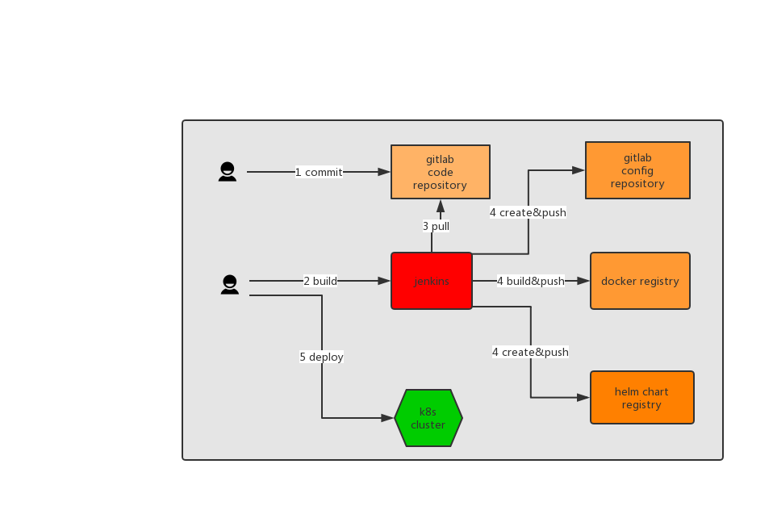
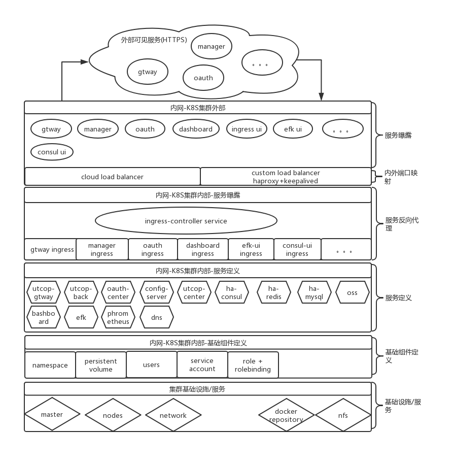

UTCOP基于 kubernetes 平台的容器化编排与部署方案

# 自动化集成
- 应用代码与应用配置分离；
- 代码打包成 docker 镜像存于内部容器仓库；
- 应用配置托管于独立的 git + config 服务中；
- 自动化构建基于 gitlba 和 jenkins ；

- [项目基础](./ci/project.md) 
```
springboot项目结构示例：

├── src/main/java
│   └── com.utcop     # 项目源码
├── src/main/resources
│   └── applications.yml      #通用配置
│   └── applications-env.yml.j2  #环境自定义配置，作为其他环境的模板
│   └── applications-dev.yml     #开发环境自定义配置
├── ci
│   └── dockerfiles
│       └── Dockerfile	  # Dockerfile 文件
│       └── build.sh		  # docker image build 与 push 脚本 
│   └── k8s
│       └── app.yaml.j2		# k8s deployment、service 部署模板文件 
│       └── build.sh		  # k8s deployment、service 文件生成脚本 
│   └── globalvalues     # 全局配置信息，目前采用 shell 变量；包含当前环境，docker registry 等配置
│   └── values          # 项目信息，目前采用 shell 变量，包含项目名称、版本、服务名称等
└── └── build.sh		    # 构建脚本，调用 dockerfiles 与 k8s 中的脚本
```

- [构建流程](./ci/buildflow.md)



# 编排部署
`kubernetes + 自由算力` 为基础设施；并配套使用一些开源项目进行；


## 环境搭建
### 开发
minkube

### 测试生产
自由算力（自有DC、私有云、公有云）作为承载；linux 操作系统之上使用 `kubeasz` 一键完成 Kubernetes 运行环境的搭建；

## 服务结构
整个体系中的服务主要包含两大类：平台基础支撑服务、UTCOP产品服务；


## 访问控制策略
严格控制集群内外/内外网 的服务可见性与身份认证授权；

## 网络规划

 
# 服务治理
## 数据高可用
高可用主从+定时备份 mysql 数据库；高可用redis集群；

## 集群联邦

## 服务自动伸缩
根据流量与机器负载自动进行服务数量的伸缩；


# 核心服务
## 认证授权中心
基于 oauth2 的开放身份认证与授权服务；

## 资源中心
提供基于租户的资源管理服务，包含 用户、组织、开发者、应用等；

## 网关
集中、自定义访问安全控制、流量管控、服务代理；

## 服务注册中心
外部服务的注册中心，作为内部其他服务访问外部服务的服务发现中心；

## 集中配置
代码与配置分离，管理全部服务的配置文件数据；


